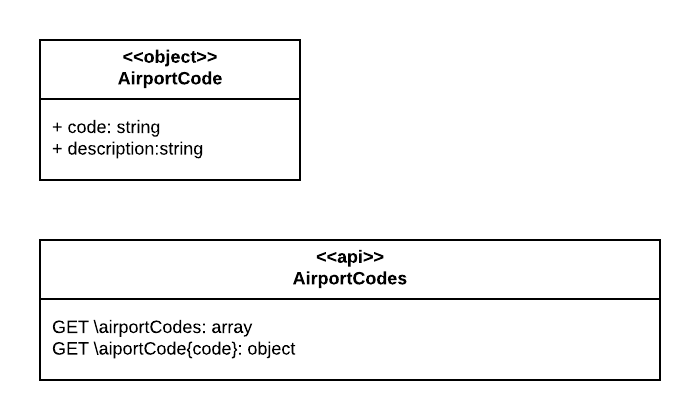

# Lab: Extending Airport Codes

Presently your company supports the specification for an `Airport Codes` API as shown in the illustration below and specified in the YAML file at the end of this `readme`.




Your assigment is to extended the API to provide the capability to search for an Airport Code by Airport Name.


... specified in this yaml file

```yaml
swagger: '2.0'
info:
  description: An API that provides airport code information
  version: 1.0.0
  title: Airport Code Lookup
  # put the contact info for your development or API team
  contact:
    email: reselbob@gmail.com
  license:
    name: Apache 2.0
    url: http://www.apache.org/licenses/LICENSE-2.0.html
# tags are used for organizing operations
tags:
- name: admins
  description: Secured Admin-only calls
- name: developers
  description: Operations available to regular developers
paths:
  /airportCodes:
    get:
      tags:
      - developers
      summary: gets all airport codes
      operationId: getAirportCodes
      description: |
        Gets all the airport codes stored in the system
      produces:
      - application/json
      responses:
        200:
          description: search results matching criteria
          schema:
            type: array
            items:
              $ref: '#/definitions/AirportCode'
        400:
          description: bad input parameter
  /airportCodes/{code}:
    get:
      parameters:
        - in: path
          name: code
          required: true
          type: string
          description: The aiport code to lookup
      tags:
      - developers
      summary: gets all airport codes
      operationId: getAirportCode
      description: |
        Gets airport information that corresponds to the submitted aiport codee system
      produces:
      - application/json
      responses:
        200:
          description: the result that corresponds to the submitted airport code
          schema:
            type: object
            items:
              $ref: '#/definitions/AirportCode'
        400:
          description: bad input parameter
definitions:
  AirportCode:
    type: object
    required:
    - airport
    - code
    properties:
      airport:
        type: string
        example: Los Angeles International Aiport
      code:
        type: string
        example: LAX
# Added by API Auto Mocking Plugin
host: localhost
basePath: /api
schemes:
 - https
 - http

```