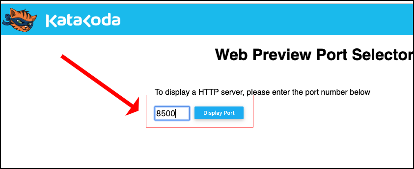

# Doing Health Checks Under Consul Service Discovery

The purpose of this lab is to get a basic understanding of Consul's health check feature

In this lab you will:

* Install a Consul server as a Docker container
* Install Registrator from Glider Labs to automatically register services with Consul
* Install three `nginx` servers and bind them to a single Consul service
* Query the Consul server for information about health of the 3 `nginx` servers when all are running and when some are running.

**Step 1:** Go to the Ubuntu Playground running under Katacoda:

`https://katacoda.com/courses/ubuntu/playground`

**Step 2:** Find the IP address of the current Ubuntu Playground host using the following command:

`ifconfig`

You get output similar to the following:


In this case the IP address is: `172.17.0.29`. Your IP address will probably be different.

**Step 3:** Install Consul as a Docker container using the following command:

`docker run -d --name=c1 -p 8500:8500 -p <YOUR_IP_ADDRESS>:53:8600/udp -p 8400:8400 gliderlabs/consul-server -node myconsul -bootstrap`

**WHERE** 

`<YOUR_IP_ADDRESS>` is the current IPAddress of Ubuntu Playground host running under Kataco

**NOTE:** Using the IP adddress shown above, the command to install Consul will be:

`docker run -d --name=c1 -p 8500:8500 -p 172.17.0.29:53:8600/udp -p 8400:8400 gliderlabs/consul-server -node myconsul -bootstrap`

**Step 4:** Get the IP address of the container running the Consul server and save it to a Linux variable, `IP` using the following command:

`IP=$(docker inspect --format '{{ .NetworkSettings.IPAddress }}' c1); echo $IP`

**SBe advised:** The IP address of the Consul server will be different than the IP address of the Katacoda host.

**Step 5:** Query the Consul server for a list of known services:

`curl $IP:8500/v1/catalog/services`

You'll get output simiar to the following:

`{"consul":[]}`

**Step 6:** Install Glider Lab's Registrator as a container.

```
docker run -d \
    --name=registrator \
    --net=host \
    --volume=/var/run/docker.sock:/tmp/docker.sock \
    gliderlabs/registrator:latest \
    -internal consul://localhost:8500
```

**Step 7:** Install the first service instance of `nginx` as a Docker container.

`docker run -d -p :80 -e "SERVICE_80_NAME=http" -e "SERVICE_80_ID=http1" -e "SERVICE_80_CHECK_HTTP=true" -e "SERVICE_80_CHECK_HTTP=/" --name=nginx1 nginx`

**Step 8:** Install the second service instance of `nginx` as a Docker container.

`docker run -d -p :80 -e "SERVICE_80_NAME=http" -e "SERVICE_80_ID=http2" -e "SERVICE_80_CHECK_HTTP=true" -e "SERVICE_80_CHECK_HTTP=/" --name=nginx2 nginx`

**Step 9:** Install the second service instance of `nginx` as a Docker container.

`docker run -d -p :80 -e "SERVICE_80_NAME=http" -e "SERVICE_80_ID=http3" -e "SERVICE_80_CHECK_HTTP=true" -e "SERVICE_80_CHECK_HTTP=/" --name=nginx3 nginx`

**Step 10:** Query the Consul server for information about the service `http`.

`curl $IP:8500/v1/catalog/service/http | json_pp`

You'll get output similar to the following:

```json
[
   {
      "Address" : "172.18.0.2",
      "Node" : "myconsul",
      "ServiceEnableTagOverride" : false,
      "ServiceTags" : [],
      "ServiceID" : "http1",
      "ModifyIndex" : 18,
      "ServiceName" : "http",
      "ServiceAddress" : "172.18.0.3",
      "CreateIndex" : 16,
      "ServicePort" : 80
   },
   {
      "Address" : "172.18.0.2",
      "Node" : "myconsul",
      "ServiceEnableTagOverride" : false,
      "ServiceTags" : [],
      "ModifyIndex" : 20,
      "ServiceID" : "http2",
      "ServiceAddress" : "172.18.0.4",
      "ServiceName" : "http",
      "CreateIndex" : 17,
      "ServicePort" : 80
   },
   {
      "Address" : "172.18.0.2",
      "ServiceEnableTagOverride" : false,
      "Node" : "myconsul",
      "ServiceTags" : [],
      "ServiceID" : "http3",
      "ModifyIndex" : 22,
      "ServiceName" : "http",
      "ServiceAddress" : "172.18.0.5",
      "ServicePort" : 80,
      "CreateIndex" : 21
   }
]
```

Notice that Consul is reporting three services running.


**Step 11:** Go the Consul Dashboard. You'll see the service running along with 3 constituent `nginx` servers.





**Step 12:** Shut down one of the `nginx` servers.

`docker ps -a`

```
CONTAINER ID        IMAGE     COMMAND                  CREATED             STATUS              PORTS                                                                                                            NAMES
b1192bf1a40a        nginx    "nginx -g 'daemon of…"   4 minutes ago       Up 4 minutes       0.0.0.0:32770->80/tcp                                                                                              nginx3
187b6f96e088        nginx     "nginx -g 'daemon of…"  5 minutes ago      Up 5 minutes        0.0.0.0:32769->80/tcp                                                                                              nginx
a7361ef7a63a        nginx     "nginx -g 'daemon of…"  5 minutes ago       Up 5 minutes       0.0.0.0:32768->80/tcp                                                                                              nginx1
```
```
docker stop 187b6f96e088
187b6f96e088
```

**Step 13:** Return the to the Consul UI and refresh the web page. Notice that the deleted web server is no longer listed in the Consul Dashboard. This is because the web server no longer passes a health test and is inactive.


**Lab Complete!**
