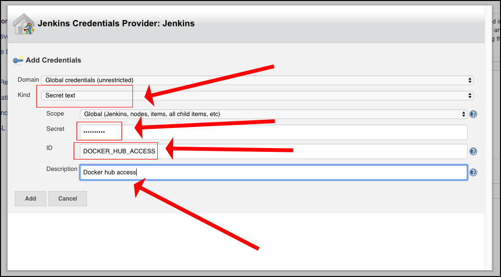
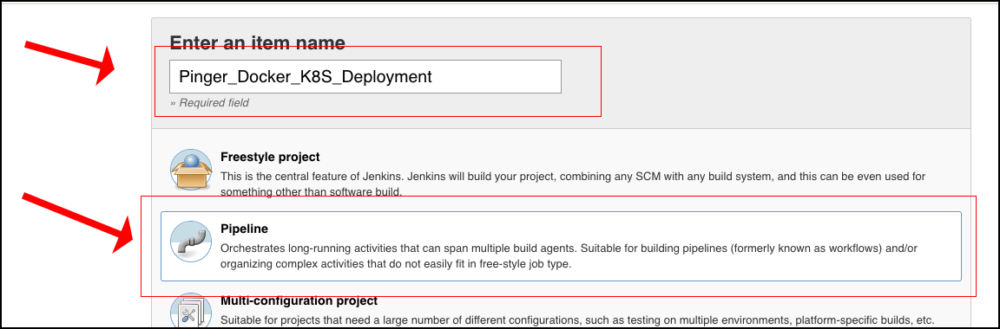

# Deploying a Microservices Oriented Application to AWS Using Jenkins

In this exercise we're going to deploy a single microservice, [`pinger`](https://github.com/reselbob/pinger) to Kuberenetes cluster using Jenkins. The process involves the following steps:

* Set up a repository on Docker Hub, if you don't have one already.
* Provision 3 virtual machines on AWS EC2.
* Provision 1 virtual machine as a Jenkins server.
* Provision the remaining two as a Kubernetes cluster.
* Configure a Jenkins pipleline job to execute the deployment.

## Setting Up A Repository on Docker Hub

If you do not have a repository on Docker Hub, create one. During the creation process you will create a `username` and `password` pair. Keep these values on hand. You'll need them when you configure the Jenkins pipeline to push a Docker image the script will create to Docker Hub.

## Creating the Deployment Environment

**Step 1:** Create 3 Virtual Machines on AWS EC2. One virtual machine will be for the Jenkins Server. The second virtual machine will be the Kubernetes Master Node. The third virtual machine will be a Kubernetes Worker Node.

**Step 2:** Follow the instruction for setting up the first virtual machine as the Jenkins Server. They are [here](jenkins-provisioning.md).

After the Jenkins Server is setup you'll access on the Internet at:

`http://<AWS_DOMAIN_URL>:8080`

**WHERE:**

`AWS_DOMAIN_URL` is the domain name that AWS generates and binds to the running instance of EC2 virtual machine you dedicated to the Jenkins server,

**Step 3:** Follow the directions for setting up the Kubernetes Cluster using `KubeAdm`. You will find the instructions [here](kubeadm.md).

## Creating the Jenkins Job

Once Jenkins is installed on the AWS Virtual Machine, you'll need to configure the server to be able push Docker imags to the Docker Hub respository. Also, you'll need to configure to the Jenkins server to access the Kubernetes cluster on AWS.

This process involves using the Jenkins Credentials plugin to define a variable that has the value of your Docker Hub password and a variable holds the complete the contents of the Kubernetes `config` file that allows `kubectl` to access the Kubernetes cluster running on AWS.

First, let's create the credential for the Docker Hub password.

### Creating a Jenkins Credential for the Docker Hub password.

### Creating a Jenkins Credential for the Kubernetes cluster `config` file.

**Step 1:** Install the Kubernetes Continuous Deployment plugin.

**Step 2:** Create a credential for the Kubernetes `config` file's contents.

**Step 3:** Create the Jenkins Job

