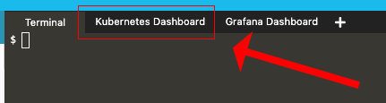
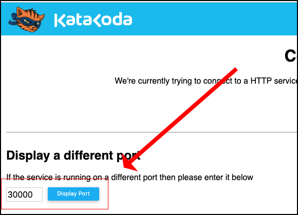
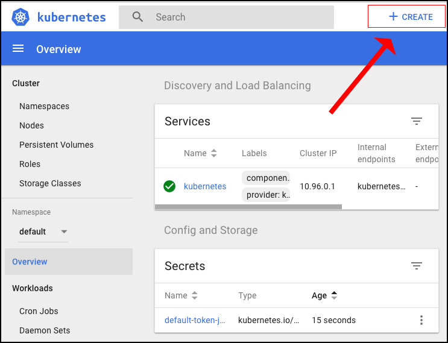
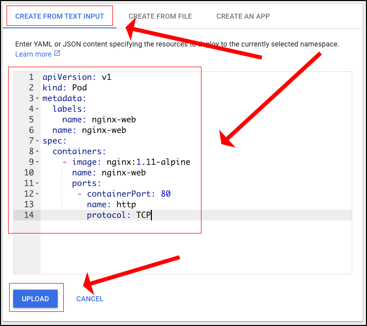
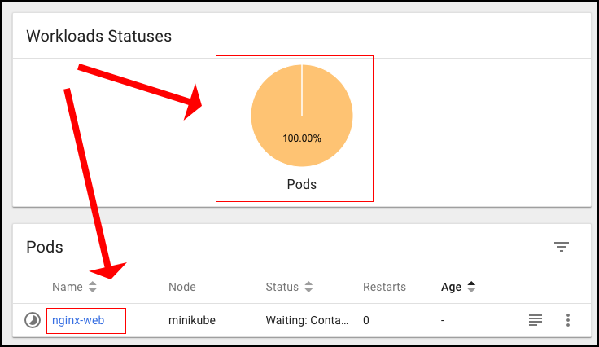
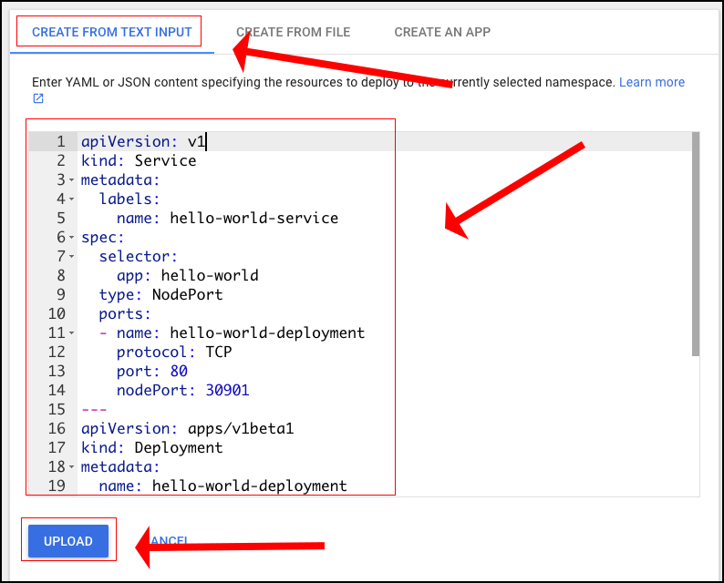
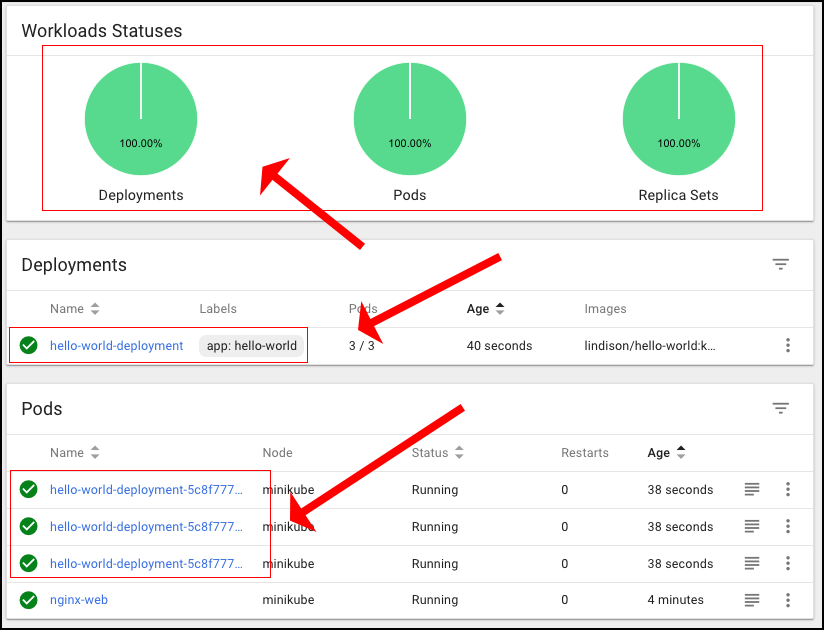
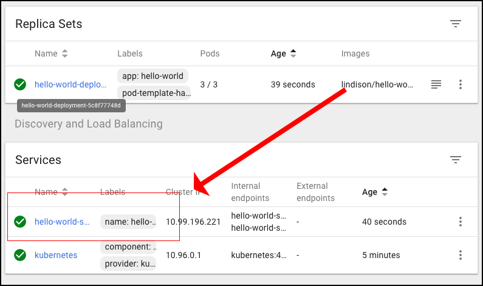

# Using the Kubernetes Dashboard

**Step 1:** Go to the Katacoda Minikube Playground

`https://katacoda.com/javajon/courses/kubernetes-fundamentals/minikube`

and start minikube

`minikube start -p myminikube`

**Step 2:** Access the Kubernetes Dashboard that is part of the playground by clicking on the icon in the menu bar.



**Step 3:** You'll be presented with the Katacoda web page to that will bind to the Kubernetes Dashboard. **Wait a minute or two for the bind mechanism to "warm up" and bind to the port.** The click the `Display Port` button on the web page.



**Step 4:** Once presented with the Kubernetes, click on the `+ Create` button in the upper right of the UI.



**Step 5:** Click the `CREATE FROM TEXT INPUT` then copy and paste the following content into the textarea that appears

```
apiVersion: v1 
kind: Pod 
metadata:
  labels:
    name: nginx-web
  name: nginx-web 
spec:
  containers:
    - image: nginx:1.11-alpine
      name: nginx-web 
      ports:
       - containerPort: 80 
         name: http 
         protocol: TCP
```



Then click the `UPLOAD` button.

**Step 6:** You'll see the that you used the Kubernetes Dashboard to create a pod.



**Step 7:** Let's create a Kubernetes Deployment and also a Service to access the pods in the deployment.

Click the `CREATE FROM TEXT INPUT` then copy and paste the following content into the textarea that appears:

```
apiVersion: v1
kind: Service
metadata:
  labels:
    name: hello-world-service
  name: hello-world-service
spec:
  selector:
    app: hello-world
  type: NodePort
  ports:
  - name: hello-world-deployment
    protocol: TCP
    port: 80
    nodePort: 30901
---
apiVersion: apps/v1beta1
kind: Deployment
metadata:
  name: hello-world-deployment
spec:
  replicas: 3
  template:
    metadata:
      labels:
        app: hello-world
    spec:
      containers:
      - name: hello-world
        image: lindison/hello-world:k8s
        ports:
        - containerPort: 80       
```
Then click the `UPLOAD` button.



You notice that now not only are there pods in the cluster, but there is also a deployment, `hello-world-deployment`. Also there are additional pods that are part of the `replicaset` that was created by the `deployment.



Also, because the manifest contained a declaration for a service, `hello-world-service`.



**Congratulations: Lab Complete!!!**


